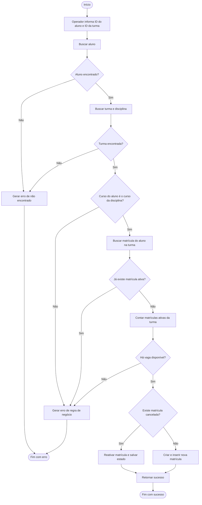

# Diagrama de atividades — matrícula

```mermaid
flowchart TD
  A([Início]) --> B[Operador informa ID do aluno e ID da turma]
  B --> C[Buscar aluno]
  C --> D{Aluno encontrado?}
  D -- Não --> E[Gerar erro de não encontrado]
  D -- Sim --> F[Buscar turma e disciplina]
  F --> G{Turma encontrada?}
  G -- Não --> E
  G -- Sim --> H{Curso do aluno é o curso da disciplina?}
  H -- Não --> I[Gerar erro de regra de negócio]
  H -- Sim --> J[Buscar matrícula do aluno na turma]
  J --> K{Já existe matrícula ativa?}
  K -- Sim --> I
  K -- Não --> L[Contar matrículas ativas da turma]
  L --> M{Há vaga disponível?}
  M -- Não --> I
  M -- Sim --> N{Existe matrícula cancelada?}
  N -- Sim --> O[Reativar matrícula e salvar estado]
  N -- Não --> P[Criar e inserir nova matrícula]
  O --> Q[Retornar sucesso]
  P --> Q
  E --> R([Fim com erro])
  I --> R
  Q --> S([Fim com sucesso])
```

A atividade representa somente o caso de uso de matrícula; cancelamento, lançamento de nota e registro de faltas são operações separadas na aplicação.
