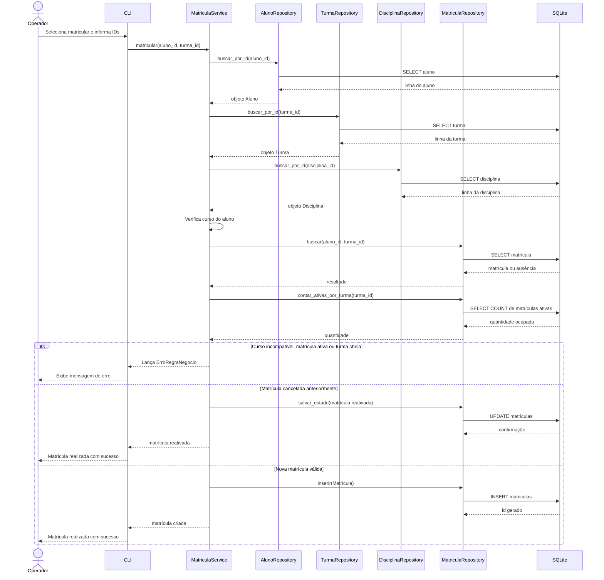

# Diagrama de sequência — matrícula

O fluxo é baseado em `MatriculaService.matricular()` e nos repositórios utilizados pelo serviço.

```mermaid
sequenceDiagram
  actor Operador
  participant CLI
  participant MS as MatriculaService
  participant AR as AlunoRepository
  participant TR as TurmaRepository
  participant DR as DisciplinaRepository
  participant MR as MatriculaRepository
  participant DB as SQLite

  Operador->>CLI: Seleciona matricular e informa IDs
  CLI->>MS: matricular(aluno_id, turma_id)
  MS->>AR: buscar_por_id(aluno_id)
  AR->>DB: SELECT aluno
  DB-->>AR: linha do aluno
  AR-->>MS: objeto Aluno
  MS->>TR: buscar_por_id(turma_id)
  TR->>DB: SELECT turma
  DB-->>TR: linha da turma
  TR-->>MS: objeto Turma
  MS->>DR: buscar_por_id(disciplina_id)
  DR->>DB: SELECT disciplina
  DB-->>DR: linha da disciplina
  DR-->>MS: objeto Disciplina
  MS->>MS: Verifica curso do aluno
  MS->>MR: buscar(aluno_id, turma_id)
  MR->>DB: SELECT matrícula
  DB-->>MR: matrícula ou ausência
  MR-->>MS: resultado
  MS->>MR: contar_ativas_por_turma(turma_id)
  MR->>DB: SELECT COUNT de matrículas ativas
  DB-->>MR: quantidade ocupada
  MR-->>MS: quantidade
  alt Curso incompatível, matrícula ativa ou turma cheia
    MS-->>CLI: Lança ErroRegraNegocio
    CLI-->>Operador: Exibe mensagem de erro
  else Matrícula cancelada anteriormente
    MS->>MR: salvar_estado(matrícula reativada)
    MR->>DB: UPDATE matriculas
    DB-->>MR: confirmação
    MS-->>CLI: matrícula reativada
    CLI-->>Operador: Matrícula realizada com sucesso
  else Nova matrícula válida
    MS->>MR: inserir(Matricula)
    MR->>DB: INSERT matriculas
    DB-->>MR: id gerado
    MS-->>CLI: matrícula criada
    CLI-->>Operador: Matrícula realizada com sucesso
  end
```
